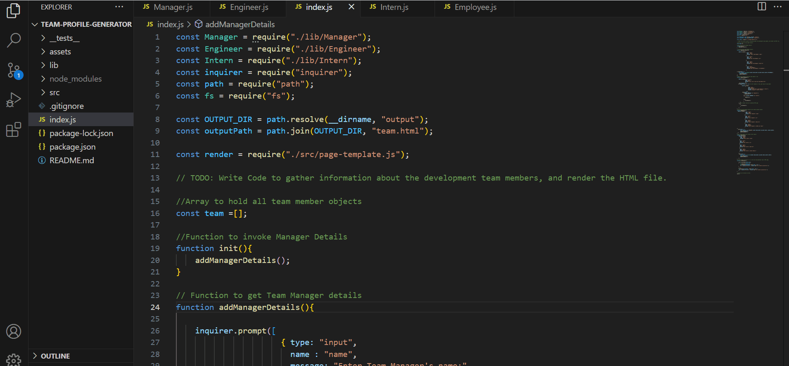
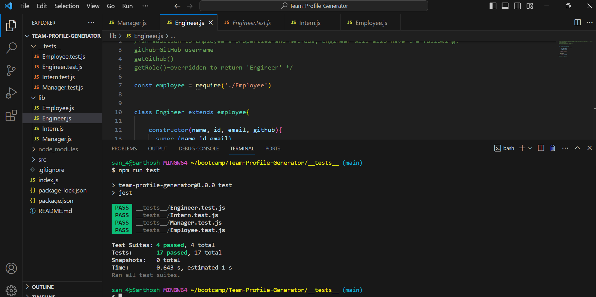
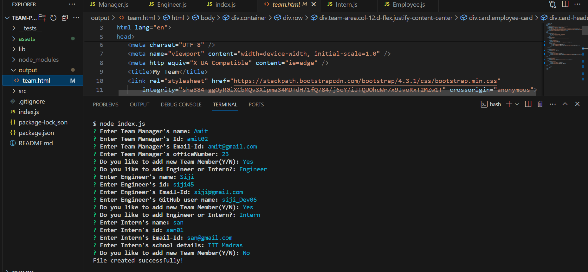

# Team-Profile-Generator
## Description:
   Team-Profile-Generator is a working Node.js command-line application. This application will take in information about employees on a software engineering team, then generates an HTML webpage dynamically that displays summaries for each person.

## Technology Used:
   The application is built using javascript, html, node.js,TDD. String literals, oops concepts used in javascript.
   Filesystem node package is used, inquirer6.5.0 npm package is used and Jest framework is used for unit Testing.

## Team-Profile-Generator Demo:
    

      The above demo shows, when a user starts the application then they are prompted to enter the **team manager**’s:
      * Name
      * Employee ID
      * Email address
      * Office number
    * When a user enters those requirements then the user is presented with a option that he wish to continue or not, if user choose yes, then user is displayed with the menu option to:
      * Add an engineer
      * Add an intern 
      * exit
    * When a user selects the **engineer** option then a user is prompted to enter the following and then the user is taken back to the option to continue or not and if 'yes', user is displayed with menu or if they choose 'no' then they exit the application and HTML is generated with given inputs.
      * Engineer's Name
      * ID
      * Email
      * GitHub username
    * When a user selects the intern option then a user is prompted to enter the following and then the user is taken back to the menu:
      * Intern’s name
      * ID
      * Email
      * School
    * When a user decides to finish building their team then they exit the application, and a ouput folder is created and a HTML is generated with name Team.html.

## Screenshots:
   

   The above screenshot shows all the tests passed after creating required classes and methods.

   

   The above screenshots shows how user is prompted for inputs to get teamdetails.

## Usage:
   To use the application install package.json by cmd 'npm init' then install
   inquirer6.5.0 npm package and install jest to execute unit testing.
   Then run index.js in integrated terminal and start to use the application.

## Reference used:

  * https://nodejs.org/api/fs.html#fsexistssyncpath
  * https://nodejs.org/api/fs.html#fsmkdirsyncpath-options
  * https://www.npmjs.com/package/inquirer?activeTab=readme#question
  * https://www.freecodecamp.org/news/object-oriented-programming-javascript/     

## GitHub Url:
   https://github.com/VinoSandy/Team-Profile-Generator.git
   
